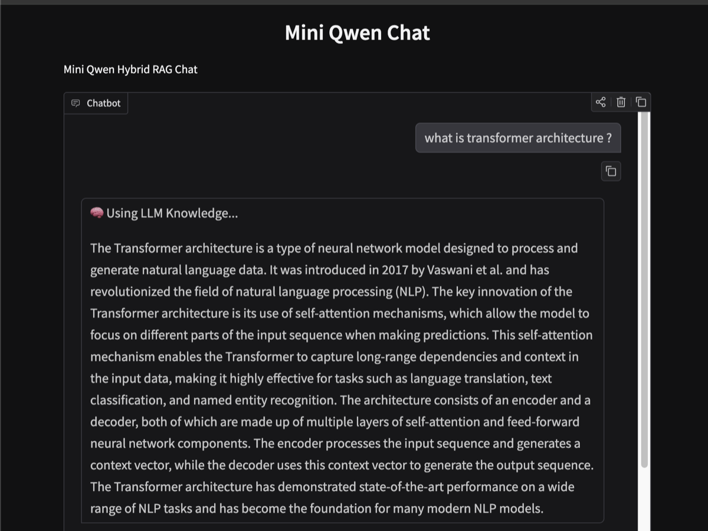
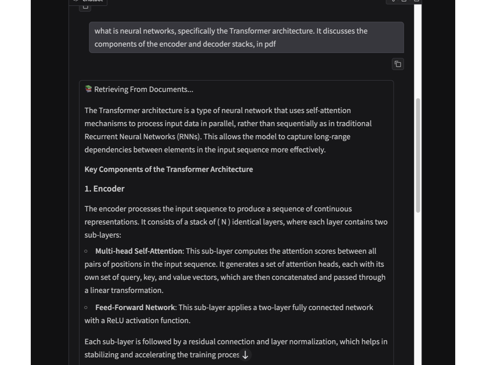
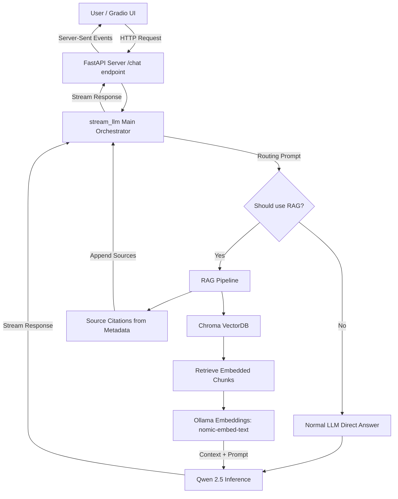
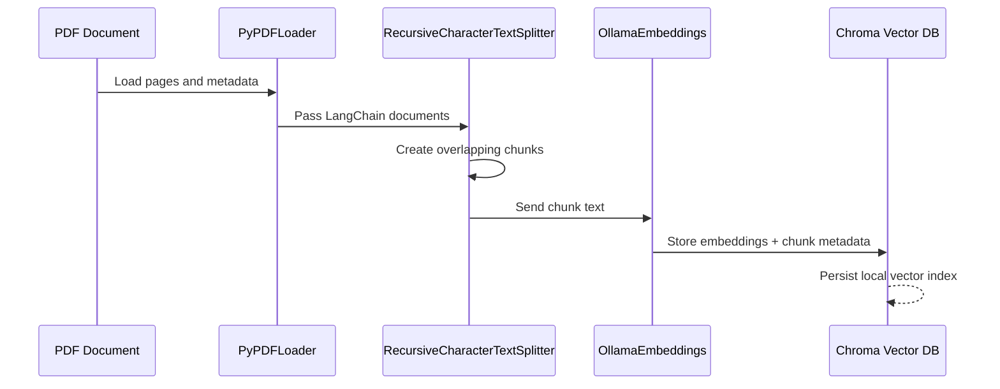
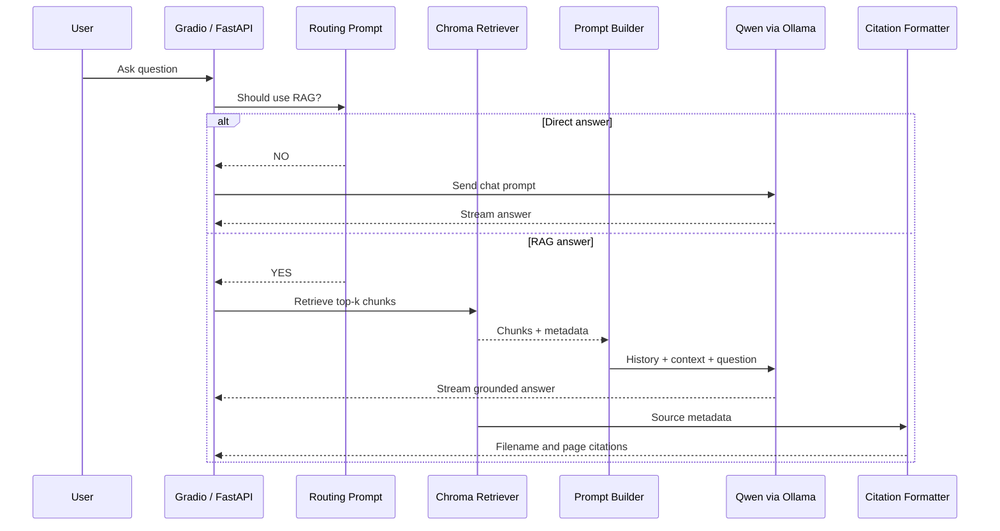

# Mini Qwen Chat 🤖

An interactive, AI-powered chat system built with local LLM orchestration. This project leverages **Qwen 2.5** (running locally via Ollama) integrated through **LangChain** with a **FastAPI** backend and a **Gradio** web interface.

## 🌟 Key Features

* **Local AI Execution**: Runs `qwen2.5-coder:7b-instruct-q6_K` completely locally using Ollama, ensuring privacy and offline capability.
* **Hybrid RAG Routing**: Intelligent routing determines if a question can be answered directly or requires document retrieval.
* **Retrieval-Augmented Generation**: Integrates a Chroma VectorDB with `nomic-embed-text` embeddings for answering context-aware questions from PDFs and documents.
* **Source Citations**: RAG answers append document citations using chunk metadata such as source filename and page number.
* **LangChain Orchestration**: Seamlessly handles prompt engineering, conversation memory, retrieval, and model interactions.
* **FastAPI Backend**: A robust, high-performance API server providing real-time text streaming and well-documented endpoints.
* **Gradio Frontend UI**: A clean, intuitive chat interface for users to easily interact with the AI assistant.
* **Streaming Responses**: Real-time token streaming for a responsive conversational experience.
## 🎨 Interface Preview

<p align="center">
  
  &nbsp; &nbsp;
  
</p>


## 🏗️ Architecture



## 🚀 Getting Started

### Prerequisites

* **Python 3.8+**
* **Ollama**: Ensure you have [Ollama](https://ollama.ai/) installed on your machine.
* **Qwen Model & Embeddings**: Pull the required models via Ollama.
  ```bash
  ollama run qwen2.5-coder:7b-instruct-q6_K
  ollama pull nomic-embed-text
  ```

### Installation

1. **Clone the repository** (or create the directory):
   ```bash
   git clone <your-repo-url>
   cd mini-qwen-chat
   ```

2. **Set up a virtual environment** (recommended):
   ```bash
   python -m venv venv
   source venv/bin/activate  # On Windows use `venv\Scripts\activate`
   ```

3. **Install the dependencies**:
   ```bash
   pip install fastapi uvicorn langchain-ollama pydantic gradio langchain-chroma langchain-community pypdf
   ```

## 💻 Usage

The application is split into two parts: the backend API and the frontend UI.

### 1. Run the Backend (FastAPI)

Navigate to the `app` directory and start the server:

```bash
cd app
uvicorn main:app --reload
```

* The API will be available at: `http://127.0.0.1:8000`
* Interactive API docs (Swagger UI): `http://127.0.0.1:8000/docs`

### 2. Run the Frontend (Gradio)

Open a new terminal, activate your virtual environment, and run the UI script:

```bash
cd app
python ui.py
```

* The Gradio interface will launch at: `http://127.0.0.1:7860`

## ✨ What This Project Covers

- ✅ **Local AI model** (Qwen 2.5 via Ollama)
- ✅ **LangChain orchestration** (Prompt engineering & Memory)
- ✅ **Hybrid RAG Routing** (Dynamically chooses between normal chat and document search)
- ✅ **Retrieval-Augmented Generation** (ChromaDB + `nomic-embed-text` embeddings)
- ✅ **Source citation rendering** (Shows retrieved file name and page number for RAG answers)
- ✅ **FastAPI backend** (Robust server with Streaming responses)
- ✅ **API routes** (Well-defined REST endpoints)
- ✅ **Swagger docs** (Interactive API documentation)
- ✅ **Real AI server** (Locally hosted without third-party API dependencies)

## 📚 RAG Pipeline

This project has two distinct RAG stages:

1. **Ingestion Pipeline**: Load PDF content, split it into chunks, embed each chunk, and persist the vectors plus metadata into Chroma.
2. **Retrieval Pipeline**: Route the user query, retrieve the most relevant chunks, build the final prompt, generate the answer, and append citations.

### 1. Ingestion Pipeline

The ingestion path is implemented in `app/rag.py`. It prepares the document corpus once and stores it in the vector database for later retrieval.



**Data store**

Chroma is the local vector data store for this project. It persists embeddings under `chroma_db/` and keeps each chunk's metadata, including the original `source` path and `page` number. That metadata is what later enables answer citations.

### 2. Retrieval Pipeline

The retrieval path is implemented in `app/chat_bot.py`. For each prompt, the application first decides whether retrieval is needed, then performs similarity search, assembles context, generates an answer, and emits citations from retrieved chunk metadata.



**Data retrieval**

At query time, the retriever runs similarity search against the stored embeddings and returns the top matching chunks. The application uses the chunk text as model context and uses chunk metadata to format a deduplicated source list such as `filename.pdf (Page N)`.

## 🔄 Data & Prompt Flow

Here is the step-by-step journey of a prompt from the user to the AI and back:

1. **User Input (Gradio UI)**: The user types a message in the Gradio web interface (`ui.py`).
2. **Frontend to Backend**: Gradio sends an HTTP POST request containing the prompt to the FastAPI backend (`main.py`) at the `/chat` endpoint.
3. **API Routing**: FastAPI receives the request, validates the JSON body using Pydantic, and calls the `stream_llm` function.
4. **LangChain Orchestration & Routing (`chat_bot.py`)**:
   - A router prompt asks the LLM if the question requires document retrieval.
   - **If No**: The prompt and conversation history are sent directly to the model.
   - **If Yes**: The prompt is queried against the Chroma VectorDB to retrieve relevant document chunks. The retrieved context, conversation history, and prompt are combined into a final prompt, and document metadata is formatted into citations.
5. **Local Inference (Ollama + Qwen2.5)**: The Qwen model processes the final prompt and starts generating a response token by token.
6. **Streaming Response**: 
   - As tokens are generated, LangChain streams them back to FastAPI.
   - FastAPI uses `StreamingResponse` to send these tokens back to the frontend in real-time.
7. **UI Update**: Gradio dynamically updates the chat interface as the text streams in, creating a typing effect.
8. **Citation Rendering**: For RAG answers, the application appends a short sources section using retrieved metadata such as filename and page number.
9. **Memory Update**: Once generation is complete, the full AI response is saved back to LangChain's chat history for future context.

## 🤝 Contributing

Contributions, issues, and feature requests are welcome! Feel free to check the issues page.
