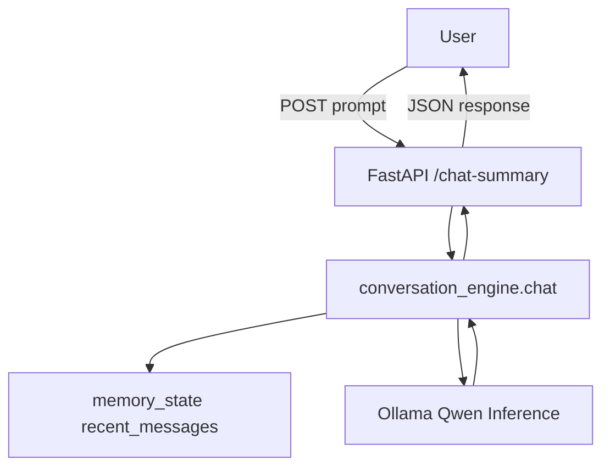
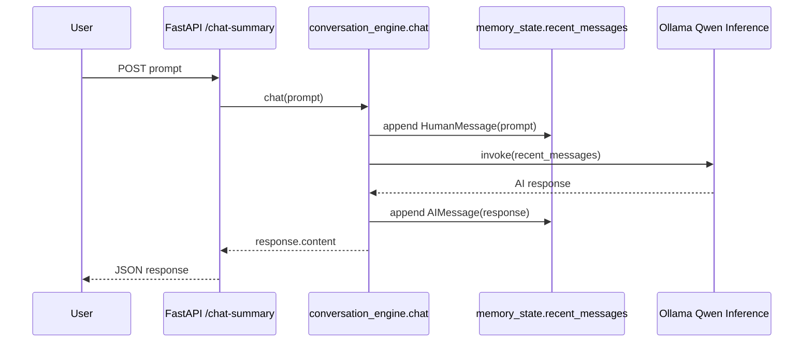

# Phase 01: Building a Simple Stateful Conversation Engine

The first milestone in `app/advanced` is a small but important shift: the chat flow now keeps conversation state in memory instead of treating every prompt as completely isolated.

This phase does not introduce persistence, retrieval, or summarization yet. Its purpose is narrower and more practical. It establishes the minimum working shape of a stateful conversation engine, proves the request flow end to end, and creates clear extension points for later phases.

Run and environment setup are documented in [README.md](/Users/vinodkhadka/Documents/AI/mini-qwen-chat/app/advanced/phases/README.md).

## Why This Phase Matters

Stateless chat is easy to start with, but it breaks conversational continuity immediately. The model answers the current input, but it does not remember the last user turn unless the application sends that history back on every request.

This phase solves that baseline problem by storing recent turns in shared memory and replaying them into the model on each call. That gives the assistant short-term memory with very little infrastructure.

## Data Flow



*Inference*: the step where the model receives input context and generates an output response.

## Sequence of Execution



*Stateful conversation memory*: keeping prior conversation turns in application state so later requests can reuse them.

*Process-local memory*: data stored inside the current running Python process, which disappears when the server restarts.

## What Was Implemented

The implementation in this phase is intentionally compact:

- `main.py` exposes a `POST /chat-summary` endpoint.
- `conversation_engine.py` appends the incoming prompt to in-memory history.
- The full `recent_messages` list is passed to the Ollama-backed chat model.
- The AI response is appended back into the same shared state and returned to the caller.

This means the next request is no longer independent. It carries the prior turns forward through the message list.

## Current State Model

The shared memory object currently looks like this:

```python
memory_state = {
    "summary": "",
    "recent_messages": [],
    "retrived_messages": [],
}
```

Each field already points toward future architecture:

- `summary` is reserved for condensed long-term conversation memory.
- `recent_messages` holds the active turn-by-turn chat history.
- `retrived_messages` is reserved for retrieval context that may later be merged into prompt assembly.

## Supporting Structure Already Added

Even though this phase only uses `recent_messages`, the folder already includes placeholders for the next layers:

- `context/summary_memory.py` for summary trigger logic
- `context/context_builder.py` for prompt and context assembly
- `context/token_manager.py` for token-budget control
- `models/`, `prompts/`, and `retrieval/` as scaffolding for later expansion

That structure matters because it keeps the first implementation simple without blocking the next iteration.

## Current Limitations

This phase is functional, but still intentionally limited:

- Memory is process-local and disappears on restart.
- All requests share one in-memory conversation state.
- Summarization is not connected to the runtime flow yet.
- Token limits are not managed yet.
- Retrieval context is not part of the advanced engine yet.

These are acceptable constraints for a first milestone because the goal here is to validate stateful chat behavior before adding more complexity.

## What Comes Next

The next phase should build on this foundation rather than replace it:

- add summarization after recent history reaches a threshold
- reduce unbounded message growth with summary plus recent turns
- introduce session-aware state instead of one global memory object
- merge retrieval context into the same advanced conversation pipeline
- enforce token budgeting before invoking the model

Phase 01 establishes the basic engine. Later phases can now focus on memory quality, scale, and context control instead of basic request wiring.
