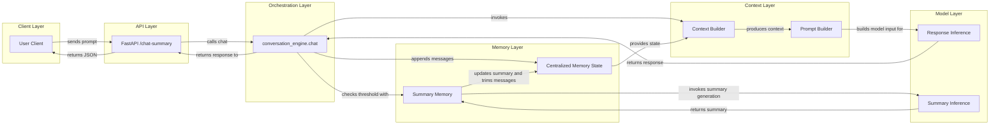
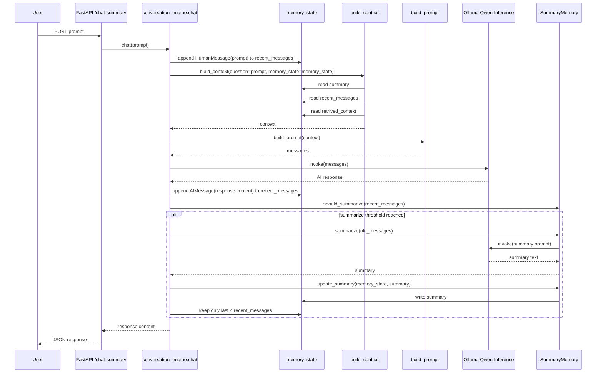

# Phase 02: Layered Memory and Context Architecture

After building the initial conversation engine, the architecture moved beyond simple message accumulation and into a more production-style memory pipeline.

This phase introduced a centralized memory state, a dedicated context builder, a structured prompt builder, and summary memory for compressing older conversations. The result is a layered system that separates raw conversation storage from context assembly and prompt generation.

Run and environment setup are documented in [README.md](README.md).

## Why This Phase Matters

Phase 01 proved that stateful chat works. The limitation was that the runtime still treated the full chat history as the primary model input. That is workable for a small prototype, but it does not scale well as conversations get longer.

This phase changes the architecture in a more deliberate way:

- memory state becomes the system of record for conversation data
- context construction becomes a separate step
- prompt generation becomes explicit instead of implicit
- older turns can be compressed into summary memory
- recent turns stay available as short-term context
- summarization uses a second model call only when the threshold is reached

That shift is important because it moves the advanced flow from chat-history replay to memory orchestration.

## Layered Architecture



*Layered architecture*: organizing the system into responsibility-based layers so each part has a clearer role.

*Inference*: the step where the model receives input and generates output. In this phase there are two inference paths: one for the user-facing response and one for summary generation.

*Centralized memory state*: one shared object that holds the conversation summary, recent messages, and reserved retrieval context.

## Sequence of Execution



*Context builder*: a layer that transforms raw state into a structured context object for downstream prompt assembly.

*Prompt builder*: a layer that converts structured context into the exact message list sent to the model.

*Summary memory*: compressed long-term memory generated from older conversation turns through a separate summarization model call.

## What Changed in This Phase

The implementation now uses several explicit layers instead of directly invoking the model with recent history alone.

### 1. Centralized Memory State

The shared memory object now tracks three distinct categories of data:

```python
memory_state = {
    "summary": "",
    "recent_messages": [],
    "retrived_context": [],
}
```

- `summary` stores compressed long-term memory
- `recent_messages` stores short-term conversational turns
- `retrived_context` is reserved for retrieval-based context integration

This is the architectural pivot point for the advanced pipeline.

### 2. Context Builder

`build_context(...)` now separates data collection from model invocation. Instead of letting the engine directly decide how to assemble messages, it first constructs a context object with:

- the current question
- the running summary
- recent conversational turns
- reserved retrieval context

That separation makes later context budgeting and retrieval integration easier.

### 3. Prompt Builder

`build_prompt(...)` converts the structured context into model-ready messages:

- a system instruction message is always added
- a summary message is added when long-term memory exists
- recent messages are appended after the system-level instructions

This replaces the earlier approach where the chat engine passed raw message history more directly to the model.

### 4. Summary Memory

`SummaryMemory` introduces controlled memory compression:

- it decides when summarization should happen
- it builds a summary prompt over older messages
- it makes a second LLM call to generate the summary when needed
- it stores the compressed result in `memory_state["summary"]`
- it keeps only the most recent turns in short-term memory

This is the first long-term versus short-term memory split in the advanced architecture.

## Architectural Shift

The practical shift in this phase is:

- Phase 01: stateful chat through growing recent message history
- Phase 02: layered memory system with summary memory plus recent-message memory

That means the application no longer treats all prior turns equally. Older information can be condensed, while recent turns remain available in full detail for continuity.

## Current Limitations

This phase is a meaningful upgrade, but it is still an intermediate architecture:

- memory is still process-local and shared across all requests
- `retrived_context` is reserved but not actively integrated yet
- token budgeting is still not enforced before model invocation
- prompt assembly is structured, but not yet optimized for context limits
- summary replacement currently uses a fixed recent-message retention window

These limits are acceptable for this stage because the focus here was architecture separation, not full production hardening.

## What Comes Next

The next likely improvements build directly on this layered design:

- add per-session or per-user memory isolation
- integrate retrieval context into the same context object and prompt flow
- add token-budget management before prompt submission
- improve summarization quality and retention policy
- introduce structured memory categories beyond free-form summaries

Phase 02 is where the advanced flow becomes a memory-driven AI system rather than a simple stateful chat loop.
