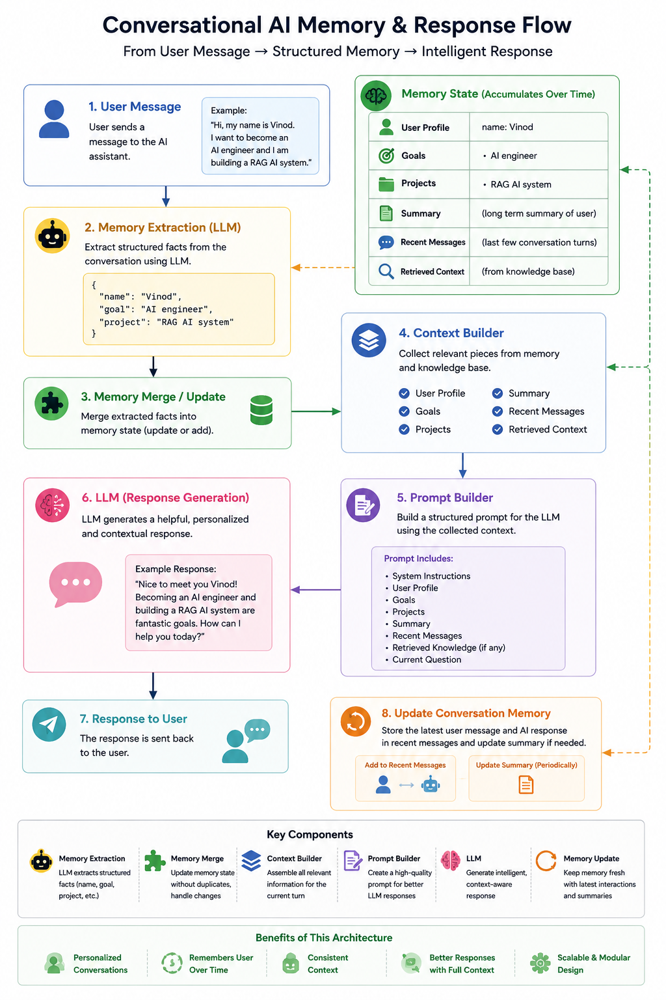
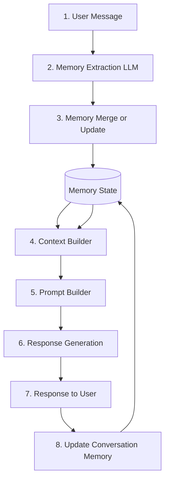

# Phase 03: Structured Memory Response Flow

This phase adds explicit structured memory on top of the layered architecture from Phase 02. Instead of keeping only a free-form summary plus recent turns, the system now extracts user facts from each message and stores them in dedicated memory fields before building the next response.

Run and environment setup are documented in [README.md](README.md).

## Why This Phase Matters

Phase 02 introduced memory layering, but the memory contents were still mostly unstructured. That makes personalization weaker because the runtime cannot reliably tell the difference between a user name, a goal, a project, or a general summary.

Phase 03 changes that by introducing a deterministic memory extraction and merge step:

- the LLM extracts structured facts from the current user message
- extracted facts are merged into `user_profile`, `goals`, and `projects`
- the context pipeline can now use stable memory categories instead of only raw turns
- summaries still handle compression, but structured memory handles identity and intent

This is the first phase where the assistant begins to remember a user in a categorized way rather than only through replayed conversation text.

## Structured Memory Flow Diagram

The diagram below is the infographic version of the new flow for this phase.



## End-to-End Execution Flow



## What Changed in This Phase

### 1. Memory State Became Structured

The shared state now includes dedicated structured sections:

```python
memory_state = {
    "user_profile": {},
    "goals": [],
    "projects": [],
    "summary": "",
    "recent_messages": [],
    "retrived_context": [],
}
```

- `user_profile` stores stable user attributes such as name
- `goals` stores user ambitions or targets mentioned over time
- `projects` stores active work or initiatives the user mentions
- `summary` remains the compressed long-term memory layer
- `recent_messages` remains the short-term conversation window
- `retrived_context` is still reserved for retrieval data

### 2. Structured Extraction Was Added Before Response Generation

`StructuredMemory.process_message(...)` now runs before the current prompt is added to recent history and before response context is built.

That extraction step asks the model for strict JSON with this schema:

```json
{
  "name": null,
  "goal": null,
  "project": null
}
```

This design matters because merge logic can update state deterministically instead of trying to parse free-form text.

### 3. Merge Logic Updates Stable Memory Buckets

After extraction:

- `name` updates `memory_state["user_profile"]["name"]`
- `goal` is appended to `memory_state["goals"]`
- `project` is appended to `memory_state["projects"]`

This gives the assistant explicit long-lived memory slots for personalization.

### 4. Context and Prompt Building Now Benefit From Structured Memory

The current `build_context(...)` function still passes summary, recent messages, and retrieved context into prompt construction. Phase 03 extends the architecture conceptually by making structured fields part of the memory system of record, even though prompt usage can still be expanded further in later phases.

In practice, this phase establishes the memory categories first so later prompt and retrieval improvements have something reliable to consume.

## Architectural Shift

The practical progression is now:

- Phase 01: short-term stateful chat through recent message replay
- Phase 02: layered context pipeline with summary memory
- Phase 03: structured memory extraction and categorized user memory

That means the system is moving from conversation continuity toward actual user modeling.

## Current Limitations

This phase is an important memory upgrade, but several limits still remain:

- `goals` and `projects` append values without deduplication
- `build_context(...)` does not yet expose `user_profile`, `goals`, or `projects`
- `build_prompt(...)` does not yet directly inject the structured fields
- memory remains process-local and shared across all requests
- extracted JSON depends on model compliance and only handles a small schema
- `retrived_context` is still reserved rather than fully integrated

## What Comes Next

The next logical steps after this phase are:

- include structured memory fields directly in `build_context(...)`
- inject user profile, goals, and projects into the prompt builder
- add deduplication and conflict resolution for structured fields
- isolate memory per user or session
- persist memory outside process memory
- expand the schema beyond name, goal, and project

Phase 03 is the point where memory stops being only conversational history and starts becoming a structured user model.
